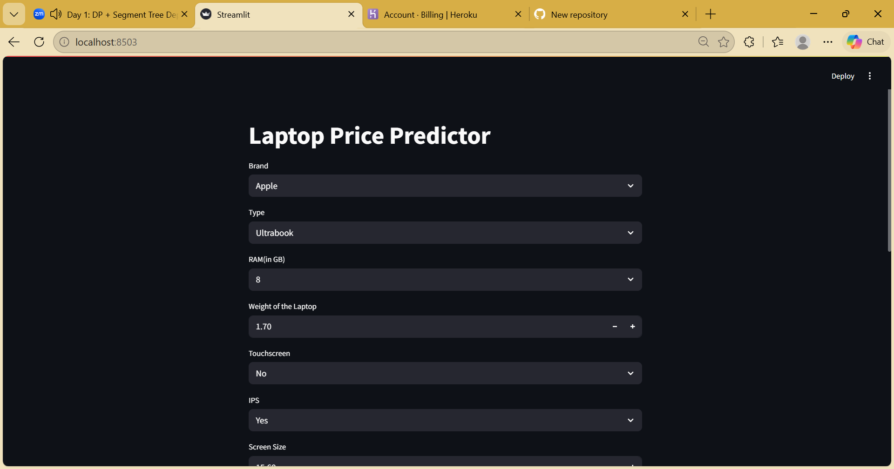
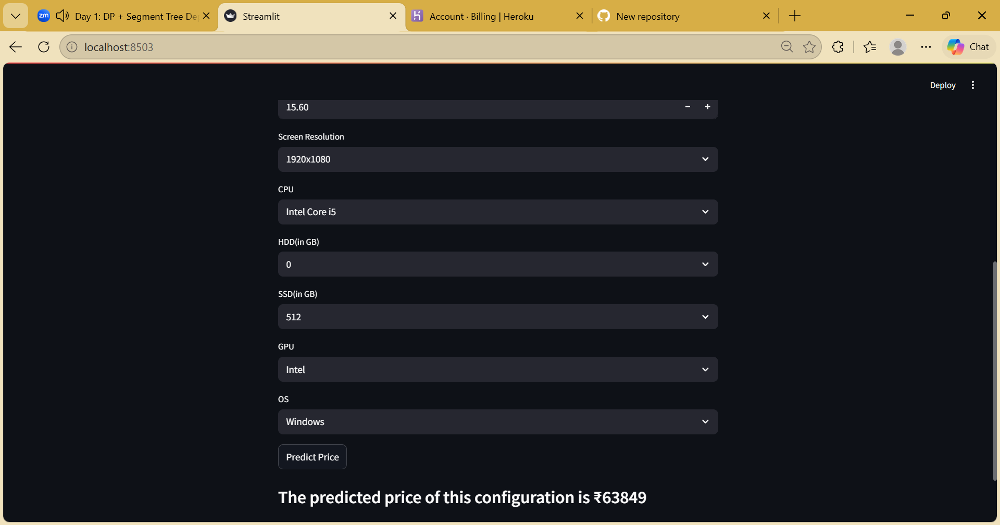

# 💻 Laptop Price Predictor 📈

An interactive Machine Learning web application built with Streamlit that predicts the price of a laptop based on its hardware specifications.

Try different combinations of processors, RAM, storage, and display types to see how they impact the final price of the machine.

## 🚀 Demo




---

## 🛠️ Tech Stack

- **Language:** Python 3.1
- **Frontend/UI:** Streamlit
- **Data Manipulation:** Pandas, NumPy
- **Machine Learning:** Scikit-Learn (Model & Preprocessing Pipeline)
- **Serialization:** Pickle

---

## ✨ Features

The model takes the following inputs to predict the price:

- **Brand:** Apple, Dell, HP, Lenovo, Asus, etc.
- **Type of Laptop:** Ultrabook, Gaming, Notebook, 2-in-1, etc.
- **RAM:** 2GB up to 64GB
- **Weight:** Custom weight input
- **Display Features:** Touchscreen, IPS Panel, Screen Size, Resolution
- **Processor (CPU):** Intel Core i3/i5/i7, AMD Ryzen, etc.
- **Storage:** HDD and SSD capacity combinations
- **Graphics (GPU):** Nvidia, AMD, Intel
- **Operating System:** Windows, Mac, Linux/Other

> **Note on the Model:** The target variable (Price) was log-transformed during training to handle skewed data. The app automatically inverses this transformation using `np.exp()` to display the price in standard currency (₹).

---

## 💻 Installation and Setup

Follow these steps to run the project on your local machine.

### 1. Clone the repository

```bash
git clone [https://github.com/](https://github.com/)[Your-Username]/[Your-Repo-Name].git
cd [Your-Repo-Name]
```
